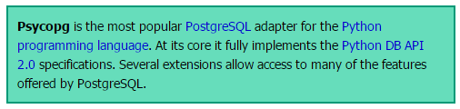
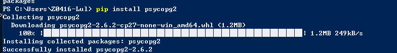
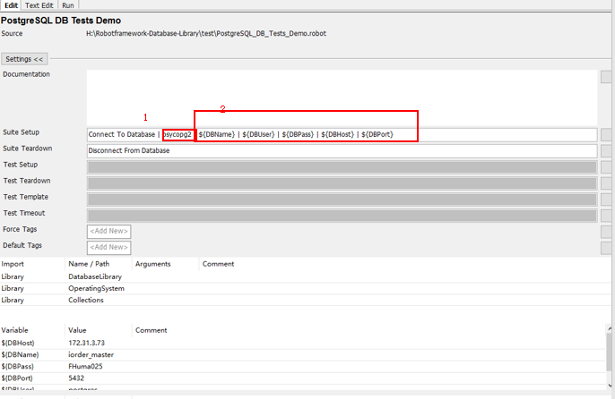
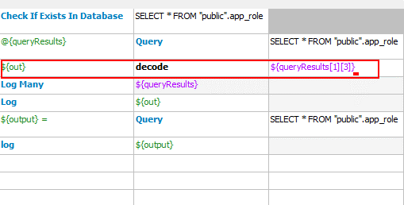
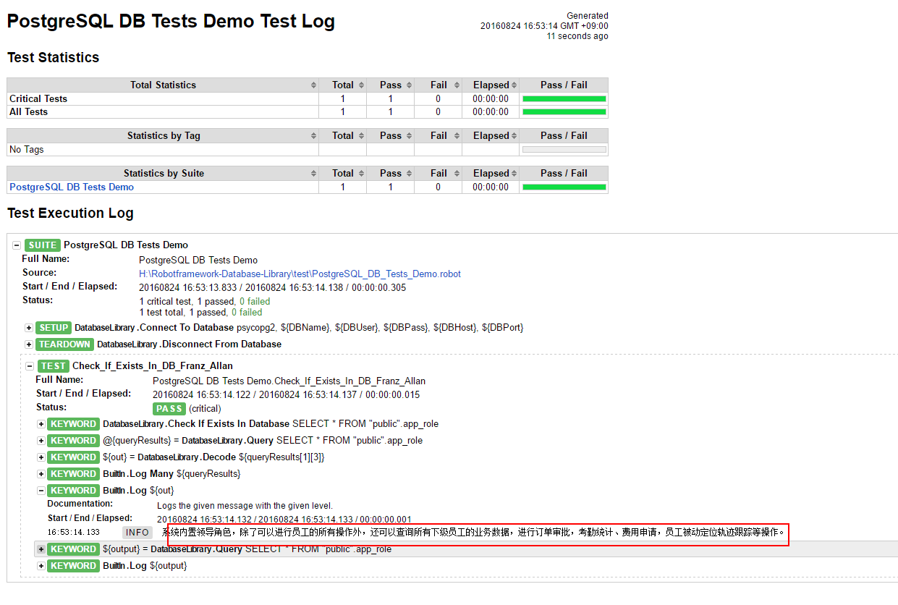

#database
这里以python连接PostgreSQL，进行操作为例；
安装：
```
pip install robotframework-databaselibrary
```
安装完成后可以继续安装psycopg2，用来连接PostgreSQL 数据库；
   
```
pip install psycopg2
```
如右图所示  

   

## Demo Case  

从源码中得知框架支持pymysql、psycopg2、pyodbc、ibm_db等连接方式，这里以pymysql为例； 
**首先需要添加SuiteSetup，SuiteTeardown**   
* SuiteSetup为连接相应的数据库
* SuiteTeardown为断开数据库连接  

具体如图
注意途中标注红色部分
具体的api信息请查看DatabaseLibrary.html
    
经过Setup连接数据库之后;可以执行case，具体如图

**需要注意的是，有些数据库反馈数据是使用的是list，Unicode**
**字符集会显示为16进制的字符，**
**这里就需要修改Query.py中的代码了，**
**这里编辑好的文件，大家替换下即可，**
**相对目录路径为：**
 **Python27\Lib\site-packages\DatabaseLibrary\query.py**
**替换完成后，具体使用方式见右图中红色部分，校验信息不受影响**
**可以正常使用.**

   
**结果**
   