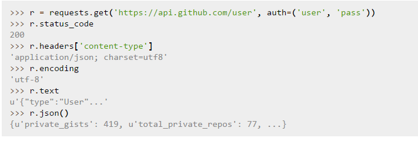
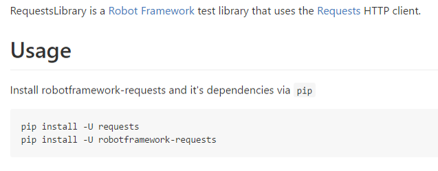
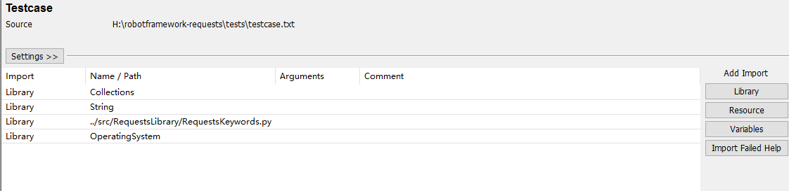
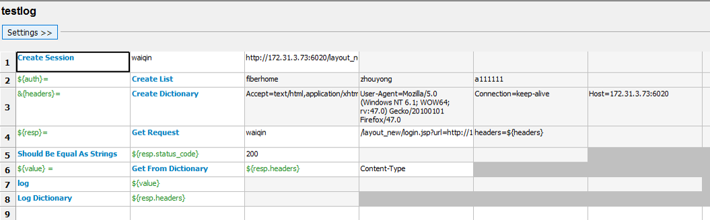
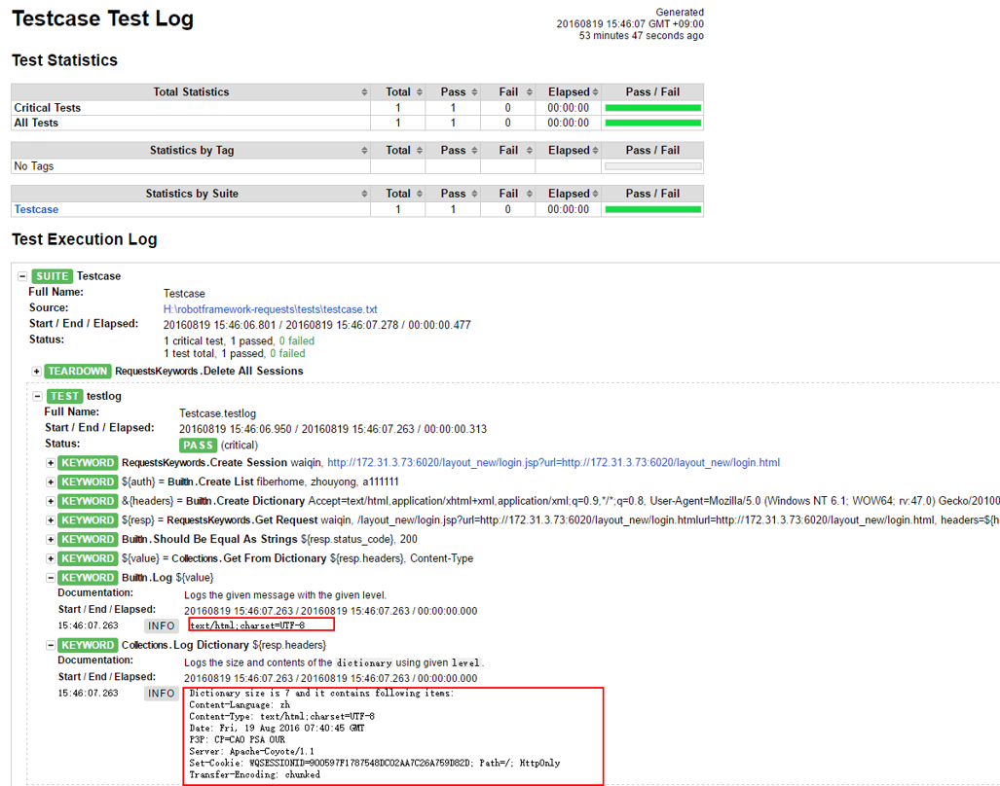

# Python Requests 接口测试
* 索引
* [接口测试](#1)
* [Http Requests](#2)
* [Robot Framework Requests](#3)

包含接口测试、具体case，Jenkins集成。
##<span id="1"> 接口测试</span>
接口测试的英文是interface testing，是测试系统组件间接口的一种测试。接口测试主要用于检测外部系统与系统之间以及内部各个子系统之间的交互点。测试的重点是要检查数据的交换，传递和控制管理过程，以及系统间的相互逻辑依赖关系等
### 狭义定义
通常，我们软件测试中所说的接口测试，是指外部接口中用于与外部系统交互接口及软件系统内部模块/组件或子系统之间的内部接口测试。例如：    
1. 系统与系统之间的调用，比如银行会提供接口供电子商务网站调用，或者说，支付宝会提供接口给淘宝调用  
2. 上层服务对下层服务的调用，比如service层会调用DAO层的接口，而应用层又会调用服务层提供的接口  
3. 服务之间的调用，比如注册用户时，会先调用用户查询的服务，查看该用户是否已经注册。  

### 代码角度看接口
```
interface 动物 { void 叫(); }

class 狗 implements 动物 { void 叫() { System.out.println("汪"); } }

class 猫 implements 动物 { void 叫() { System.out.println("喵"); } }
```
这里采用java接口实现的方式来展示，叫() 就可以接口函数，反正我不管你叫()函数里面是怎么样实现的，我只认接口叫()。如上，对猫和狗的叫声不一样，也就是说实现不一样，但是接口一样都是叫()，猫也好，狗也好，都调用叫()。如果不是采用接口形式，而是对猫采用猫叫(),对狗采用狗叫(),当外界环境变化，比如，来的是狐狸叫，那就要修改函数为狐狸叫()，那就麻烦了。
接口文档应该包含接口名，参数名，参数类型，参数含义说明，取值限制，是否可空等

#### 意义：  

* **提高测试质量**  
软件开发的过程是一个持续集成和改进的过程，而每一次的改进都可能引进新bug,因此当软件的一部，或者全部修改时，都需要对软件产品重新进行测试。其目的是要验证修改后的产品是符合需求的，而当没有自动化测试代码时，往往会由于各种各样的原因，回归不充分，导致bug遗漏。
* **提高测试效率**   
软件系统的规模越来越大，功能点越来越多，开发人员的自测或者测试人员的人工测试非常耗时和繁琐，势必导致测试效率的低下，而自动化测试正好解决这些耗时繁琐的任务，在对外接口功能不变的情况下，达到了一次编写，永久使用的效果。
* **提高测试覆盖**  
通过手工测试很难测试到一些更深层次的异常和安全的问题，通过一些辅助的一些测试工具，能分析出代码的覆盖率，通过覆盖率的提高来提高测试的深度。
* **更好地重现软件缺陷**  
由于每次执行都是相同的代码，一旦代码出错，必定回归出错
* **更好定位错误**  
由于接口测试是一种自下向上的测试，因此一量出错，非常容易定位出错，不向系统测试那样了，一旦有Bug，需要几层验证之后才能确定出错位置
*  **降低修改bug的成本**  
接口测试基本和开发人员的编码平行工作，因此发现问题会比系统测试早很多，因此减少了修改bug的成本。
* **增进测试人员和开发人员之间的合作关系**  
测试工程师为了更好地开展工作，需要对开发技术有深入的理解和实践，有了与开发工程师更多的交流。
* **降低了项目不能按时发布的风险**  
由于接口测试很早就介入，在提交给系统测试前对项目代码的核心模块已经做了详尽的测试，必定加速系统测试的时间，由此来保证项目的按时发布。
* **提升测试人员的技能**  
做接口测试必须了解开发人员的开发流程和一些开发技能，也需要了解测试工具的一些使用方法和一些测试思想，提升了测试人员的技术附加值，提高了自身的竟争力。
* **促使项目开发过程的规范化**  
要进行接口，需要完善的文档进行保障，没有测试文档，接口测试将寸步难行，接口测试将增加开发过程规范化产出，而规范化产出也保证了项目质量.   

## <span id="2">Http Requests</span>   
Requests 提供了几乎所有HTTP动词的功能：GET、OPTIONS、HEAD、POST、PUT、PATCH、DELETE。  
**例子：**  
   

API：http://docs.python-requests.org/zh_CN/latest/api.html#sessionapi

## <span id ="3">Robot Framework Requests</span>  
Github：https://github.com/bulkan/robotframework-requests  
  

安装之后，就可以使用ride编写测试用例。
API文档：http://bulkan.github.io/robotframework-requests/，  注意查看API。

## 具体case  
*  加载库如下：  
 
  
Case 如下：例子是通过抓包工具得到的数据：  

   

具体结果如下：  

   

## Case管理
关于case 管理这块，主要还是按照ride的思想来管理。

## Jenkins集成。

具体见[持续化集成测试](持续化集成测试.md)