# Appium
[Appium](https://github.com/appium/appium) 是一个移动测试框架，支持ios，android，firefox os，同时还支持H5混合应用。

** 目的：** 通过本文对于Appium，RobotFramework-appium结合的方法，可以方便搭建Appium自动化测试框架，Case编写简化。如果不关注原理，可以略过下面的Appium 项目&原理。
## Appium安装
Appium安装见[环境配置](环境配置.md)的Appium篇。
## Appium 项目&原理
** 官方介绍：**
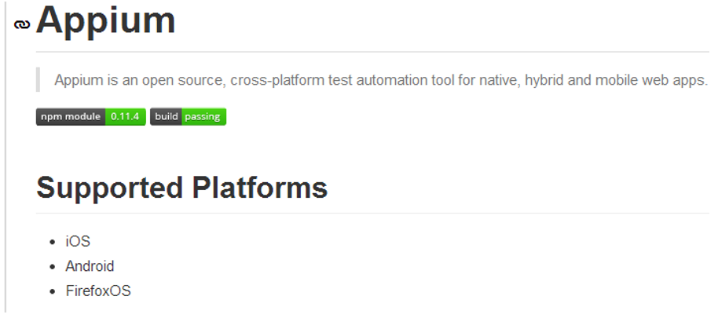    
### 目前mobile自动化的方案
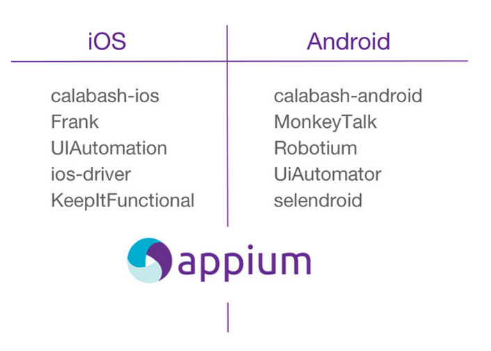    
### Appium的优点
* 跨架构，native	hybrid	webview
* 跨设备，android	ios	 firefox os
* 跨语言， java	 python	ruby	 nodejs	php
* 跨app,	 可以在多个app之间交互	 
* 不依赖源代码
* 不限制测试框架和平台	  

### Appium在Android上的架构
  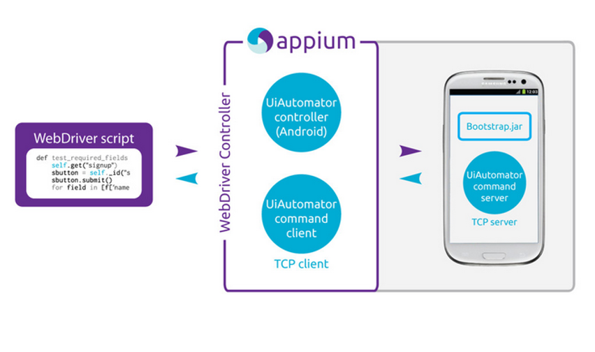   

 bootstrap.jar在appium中是以jar包的形式存在的，它实际上是一个uiautomator写的case包，通过PC端的命令可以在手机端执行。  
 ## appium 在android端工作流
  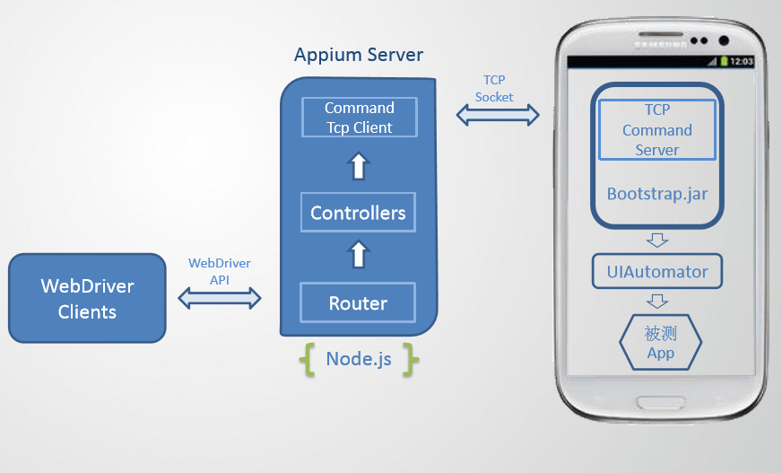   
 >在Android端，appium基于WebDriver协议，利用Bootstrap.jar，最后通过调⽤用UiAutomator的命令，实现App的自动化测试。
>UiAutomator测试框架是Android SDK自带的App UI自动化测试Java库。
>另外由于UiAutomator对H5的支持有限，appium引入了chromedriver以及safaridriver等来实现基于H5的自动化。   


* client端也就是我们 test script是我们的webdriver测试脚本。

* 中间是起的Appium的服务，Appium在服务端起了一个Server（4723端口），跟selenium
Webdriver测试框架类似， Appium⽀持标准的WebDriver JSONWireProtocol。在这里提供它提供了一套REST的接口,Appium Server接收web driver client标准rest请求，解析请求内容，调⽤用对应的框架响应操作。

* appium server会把请求转发给中间件Bootstrap.jar ，它是用java写的，安装在手机上.
Bootstrap监听4724端口并接收appium 的命令，最终通过调⽤用UiAutomator的命令来实现。

* 最后Bootstrap将执行的结果返回给appium server。

* appium server再将结果返回给 appium client。

## Appium在IOS上的架构  
 (这部分暂时没有展开，后续展开)  


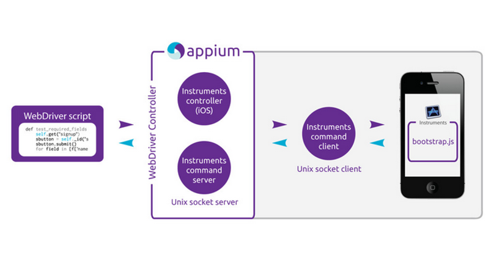 


### Appium 代码例子  

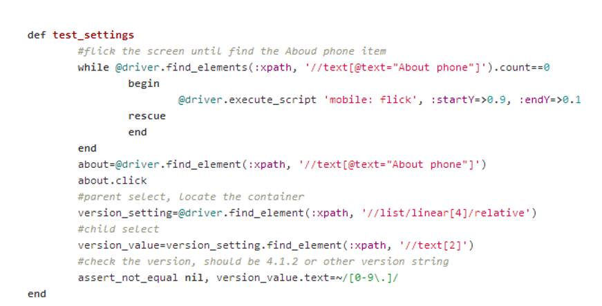    
### 总结    

*  使用 WebDriver 封装App操作接口，通过HTTP API使多语言的客户端支持成为可能。
*  异步队列。根据业务需求，将大量操作请求，通过队列的形式逐步分发执行，防止压力过大。
*  稳定性稍显不足appium 脚本在运行时不十分稳定。
*  代码不够清晰、简洁工程模块非常多，但是组织不够清晰，代码编写不够简洁。
*  多机支持不够简单one server To one client 架构导致多设备支持略麻烦。

## RobotFramework+Appium
** 官方介绍：**
* AppiumLibrary is an appium testing library for RobotFramework.
* It uses Appium (version 1.x) to communicate with Android and iOS application similar to how Selenium WebDriver talks to web browser.
AppiumLibrary is modeled after (and forked from) appiumandroidlibrary, but re-implemented to use appium 1.X technologies.
* It support Python 2.x only.  

## RobotFramework+Appium 的测试用例演示
*  启动应用  

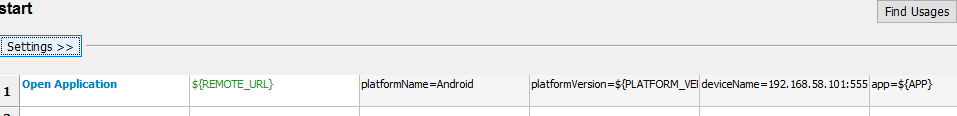
*  Login   

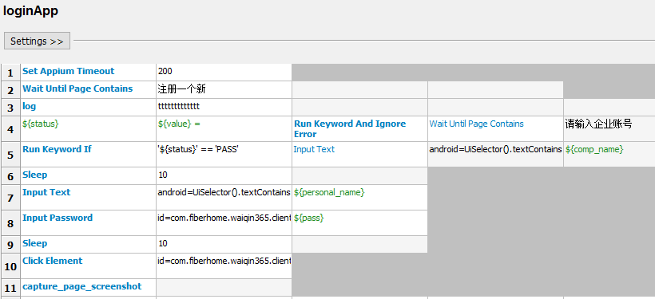
* Case  

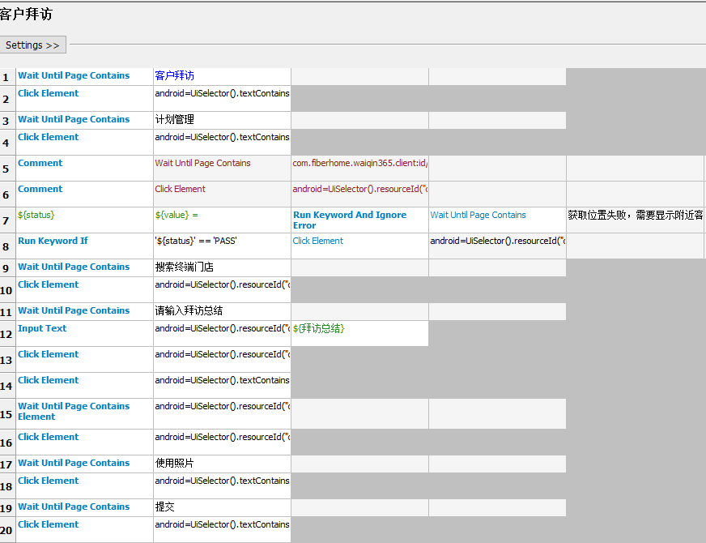   

### 结果  
report
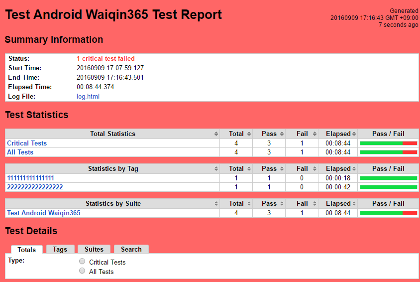  

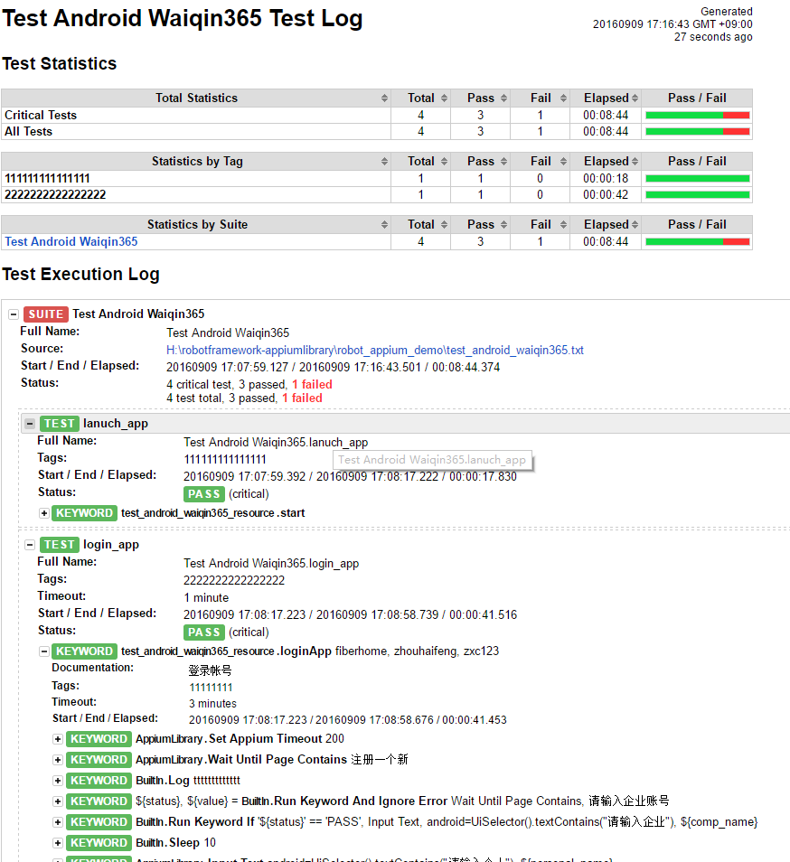    

**错误截图：**  

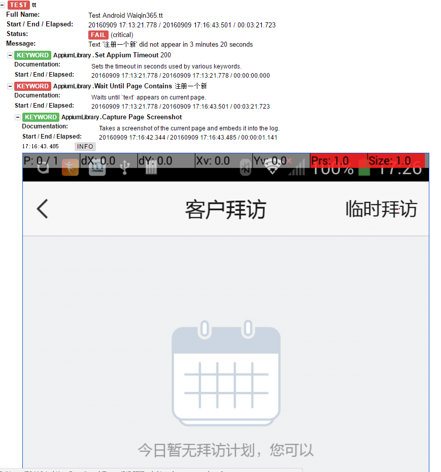  

## 性能结合测试  

由于robot framework 并不包含性能测试API，所以需要自己设计性能模块。这里采用MCM(Memory CPU Monitor),来源testerhome,之前做手机整机测试使用过，示图如下。
*  文档如下，获取的结果放在csv文件中，通过解析得到下面图象。  

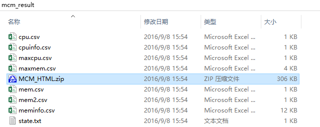
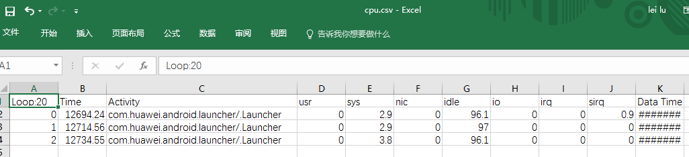
*  图像如下：  

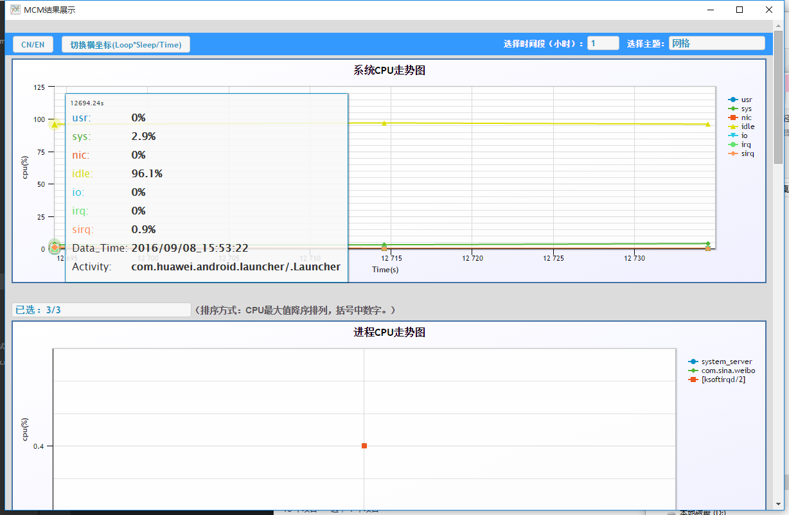
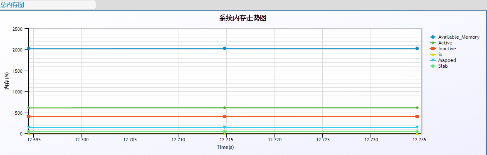
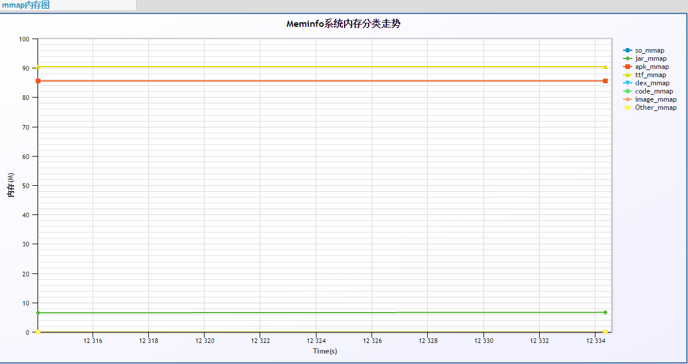
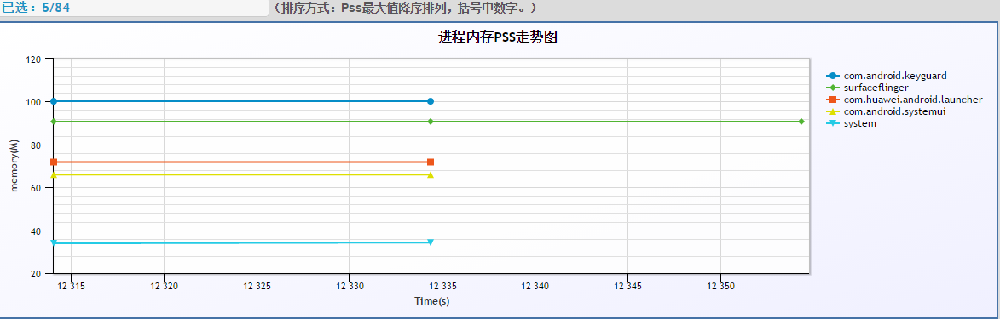
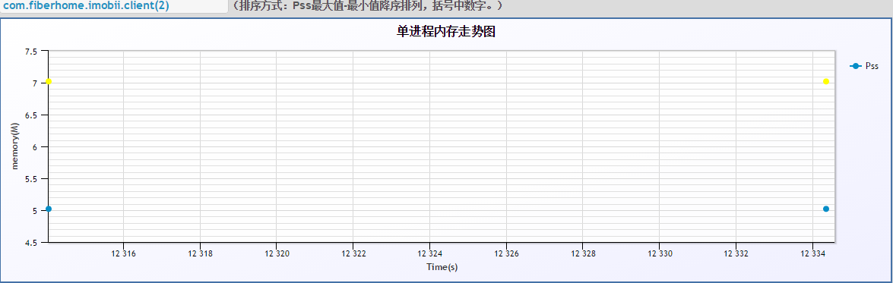

## Appium多台设备共同调试

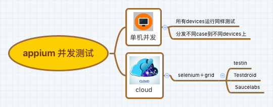
关于appium并发，我将之分为2类，第一类单机并发。第二类基于selenium grid 多节点并发测试,也可称之为云测。

appium 单机并发

Android并发测试
Appium提供了在一台设备上启动多个Android会话的方案。
```
appium -p 4492 -bp 2251 -U 32456
```
启动多个Android会话的重要指令包括：


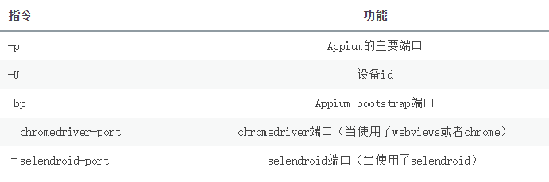  

** 总结:
单机并发目前只能在android实现，且必须启动n个appium server 对应不同devices，这里devices可以是真机或模拟器。但是必须保证端口后没有重复使用。
接下来工作就是利用测试框架(testng,jasmine,rspec,cucumber等)将测试分发到不同appium server上。 **

## appium grid 分布式并发
appium grid 分布式并发暂时不表。
