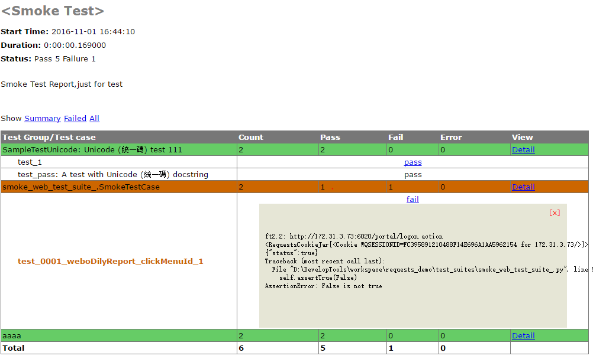

#Python Requests Auto Test Framework
## 一、格式
**例子**
smoke_web_test_xxx.py,这里的xxx代表模块，比如考勤。
```python
class SmokeTestCase(unittest.TestCase):
    '''
    1、此类用于编写smoke test case 的，在禅道上面表现为：关键字为smoke；
    '''

    def setUp(self):
        '''
        unit setup(),在所有测试case之前执行。
        :return:  global cookies ，便于后续操作
        '''
        global cookies
        r = public_funtions.login_func("172.31.3.73:6020","ywcsb","zhouyong","a111111")
        print r.cookies
        print r.content
        '''
        assert 用来验证返回值是否为想要的返回值，如果不对则返回False，正确为True
        '''
        self.assertTrue(r.json()[u'status']==True)
        cookies = "WQSESSIONID="+r.cookies["WQSESSIONID"]
        # 返回cookies为headers使用cookies，需留意。
        return cookies
    def tearDown(self):
        '''
        teardown() 是测试执行完成后，所做的操作
        :return:
        '''
        pass
    def test_0000_weboDilyReport_clickMenuId(self):
        '''
        1、具体的测试case，从这里开始首先必须'test_'开头，否则unittest不识别为用例，
        2、名称的第二部分为case在禅道上面的id，
        :return:
        '''
        c = web_weibo_dailyRport.clickMenuId("a",cookies,"d")
        print c
        self.assertTrue(c)

    def test_0001_weboDilyReport_clickMenuId_1(self):
        '''
        1、具体的测试case，从这里开始首先必须'test_'开头，否则unittest不识别为用例，
        2、名称的第二部分为case在禅道上面的id，
        :return:
        '''
        c = web_weibo_dailyRport.clickMenuId("a", cookies, "d")
        print c
        self.assertTrue(c)

if __name__ == '__main__':

    unittest.main()

```
public_functions.py
```python
# -*- coding:utf-8 -*
import requests

"""
这里是编写公共方法的类
"""
def req_post(url, headers, data):
    '''
    基础请求方法，post 请求
    :param url:
    :param headers:
    :param data:
    :return: r :response
    '''
    r = requests.post(url=url, headers=headers, data=data)
    return r


def login_func(host, tenantname, code, password):
    '''
    base function ,登录，主要用于cookies产生
    :param host:
    :param tenantname: 企业号
    :param code: 登录名
    :param password: 密码
    :return: r ;登录后的response
    '''
    url = "http://" + host + '/portal/logon.action'
    print url
    headers = {
        "Connection": "keep-alive",
        "Referer": "http://" + host + "/layout_new/login.jsp?url=" + "http://" + host + "/layout_new/login.html",
        "Accept-Language": "zh-CN",
        "x-requested-with": "XMLHttpReques",
        "Content-Type": "application/x-www-form-urlencoded; charset=UTF-8",
        "Accept-Encoding": "gzip, deflate",
        "Pragm": "=no-cache",
        "Accept": "application/json, text/javascript, */*; q=0.01",
        "User-Agent": "Mozilla/4.0 (compatible; MSIE 8.0; Windows NT 6.1; WOW64; Trident/4.0; SLCC2; .NET CLR 2.0.50727; .NET CLR 3.5.30729; .NET CLR 3.0.30729; Media Center PC 6.0; .NET4.0C; .NET4.0E; InfoPath.3)",
        "Content-Length": "195",
        "Host": host
    }
    data = {
        "identifiers.password": password,
        "identifiers.tenantname": tenantname,
        "identifiers.code": code
    }
    r = req_post(url, headers, data)
    return r
```
以上为基本格式，具体**单模块的函数方法**也同public_funciotn.py 相同注释，相同结构。
##二、报告整理
如下图所示：

**上图为结果报告，需要结果在runner下进行设置；具体如下：**  
Smoke_web_TestRunner.py
```python
 def test_main(self):
        # Run HTMLTestRunner. Verify the HTML report.

        # suite of TestCases
        self.suite = unittest.TestSuite()
        self.suite.addTests([
            #在这里添加要执行的class，注意啊，class。在执行这一步需要导入模块的testsuite。
            unittest.defaultTestLoader.loadTestsFromTestCase(smoke.SmokeTestCase),
            unittest.defaultTestLoader.loadTestsFromTestCase(aaaa),
            ])

        # Invoke TestRunner
        buf = StringIO.StringIO()
        #runner = unittest.TextTestRunner(buf)       #DEBUG: this is the unittest baseline
        runner = HTMLTestRunner.HTMLTestRunner(
                    stream=buf,
                    title='<Smoke Test>',
                    description='Smoke Test Report,just for test'
                    )
        runner.run(self.suite)
```
然后在dos里面执行命令
```dos
python  Smoke_web_TestRunner.py  >  Smoke_web_TestReport.html
```
然后就可以看到如上图的报告了。**一般调试过程中不需要每次都生成报告**。

## 三、约定
对于case 编写过程中，除了需要添加上面的注释，还需要按照约定来编写相应的代码。具体如下：  
* 一个方法尽可以只测试一个用例，所有的方法命名均为test_用例名称；
* 尽量做到一个功能特性只有一个class测试类，类的名称为smoke_web_xxxx(),client_smoke_xxx(),xxxx表示模块，
* 为了在结果报告中区分是否成功与报错信息，需要添加assert，具体见上面smoke_web_test_xxx.py
* 对于需要打印到结果的信息，直接print即可，已经封装了流的方法。
* 对于headers和data里面的参数，尽量使用参数化，参数类型为str，这点需要注意，headers、data均为dict。
* 每个方法的注释请加上作者名称，如果整个类是由一个人完成的，则只需在类文件中加上作者即可
* 有变量都要参数化；如用例编号、提求信息等；目的：方便后续维护与拓展
* 对于一些经常使用的方法，要适量封装。如果是很多模块都适用，则需要放入public_functions中。
* 判断返回值是否正确，统一使用assert。

后续持续更新
