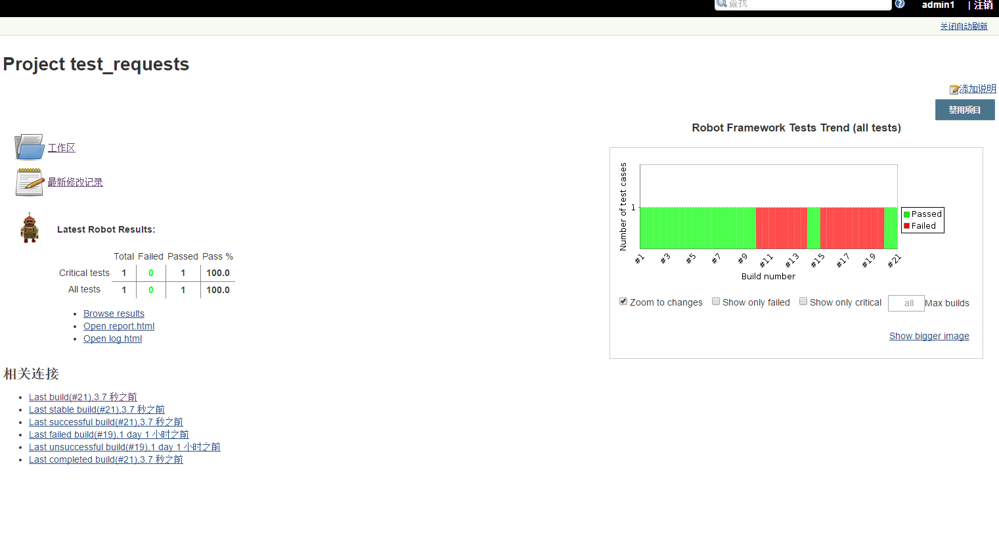
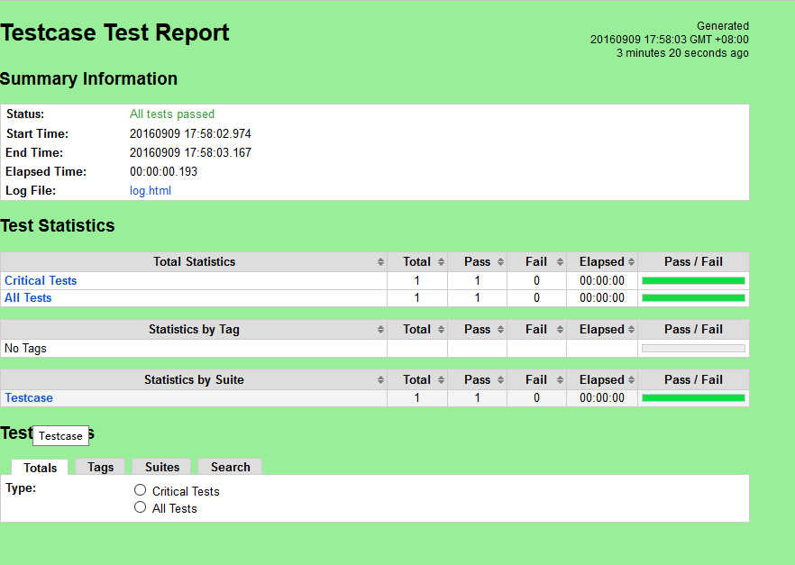
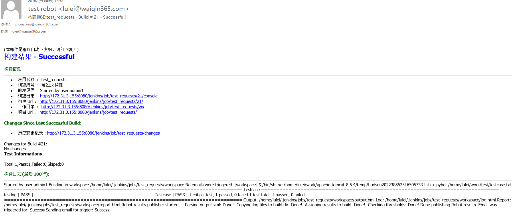

# Jenkins 持续化集成    
目的：持续化集成测试达到真正的“自助式”自动化测试。极大地提高开发和测试团队自动化脚本的使用效率和便捷性。  

**注：暂时只介绍requests结合例子。**

Jenkins 提供了现成的插件。可以直接使用。

通过简单指令结合就可以执行起来。
  
结果就是如rebot framework 结果。
   
**邮件**
   
连接jenkins 显示
