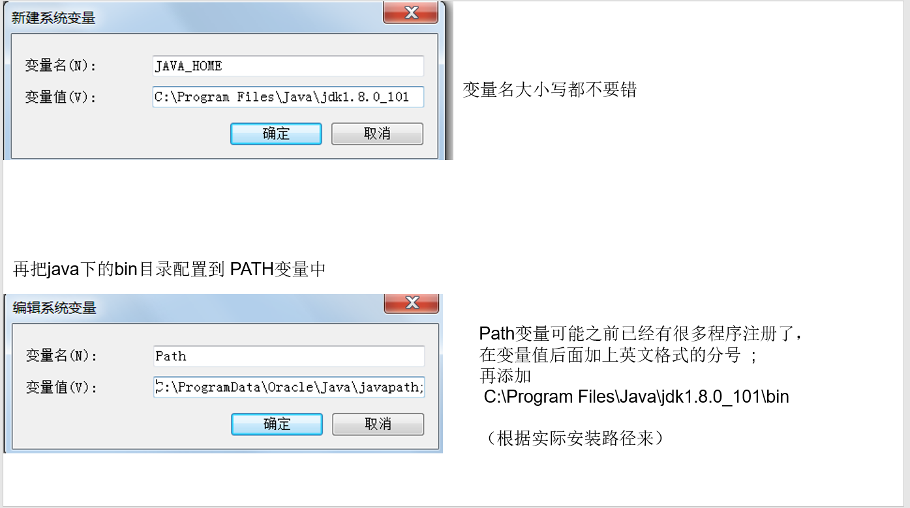
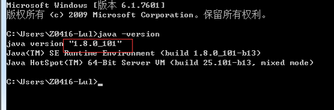
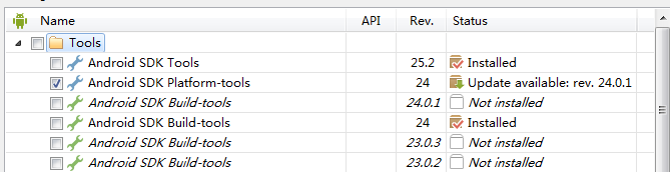
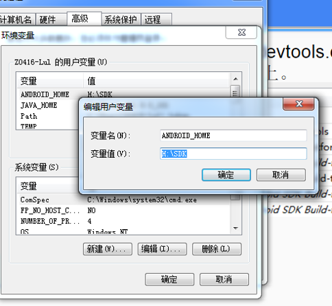
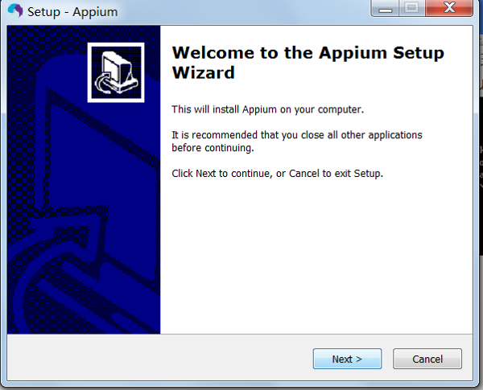
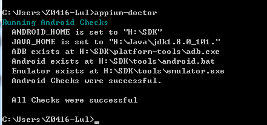

# 环境配置
包括JDK 安装、Android SDK 配置、Python 安装、Appium 安装。  
* 全部安装为Appium Android  环境变量
* Requests 只需要Python 安装即可。

# JDK 安装
到[Oracle java网站下载](http://www.oracle.com/technetwork/java/javase/downloads/index.html)对应版本的JDK,安装、配置环境变量。  
** 注： **一定要配置"JAVA_HOME"变量。否则Appium会出现问题。  
如图  
  
** 安装完成后，检验，如果如下所示，则表示成功。不成功还需要检查环境变量配置。**  

# Android SDK 配置
从android devtools 下载新版本的sdk tool，http://www.androiddevtools.cn/， 更新下载build-tools、platforms、platform-tools、tools；按需求下载，现在大部分手机都是5.0以上。  
   
配置各目录的环境变量：
ANDROID_HOME sdkHome目录，  
   
Path目录再加上3条（实际路径根据sdk放置的位置来):如下
>H:\SDK\tools;  
>H:\SDK\platform-tools;  
>H:\SDK\build-tools\24.0.1

# Python 安装

# wxPython 安装

# Appium 安装
Appium [地址点我](http://appium.io/)，下载后Windows去接安装即可。

安装好，配置环境变量，
配置在path下增加2条目录  
>D:\Program Files (x86)\Appium\node_modules\.bin；  
>D:\Program Files (x86)\Appium；     

运行appium-doctor如果提示如下：
如果出现问题则需要根据提示检查环境变量配置
  
到此已经安装完毕。
